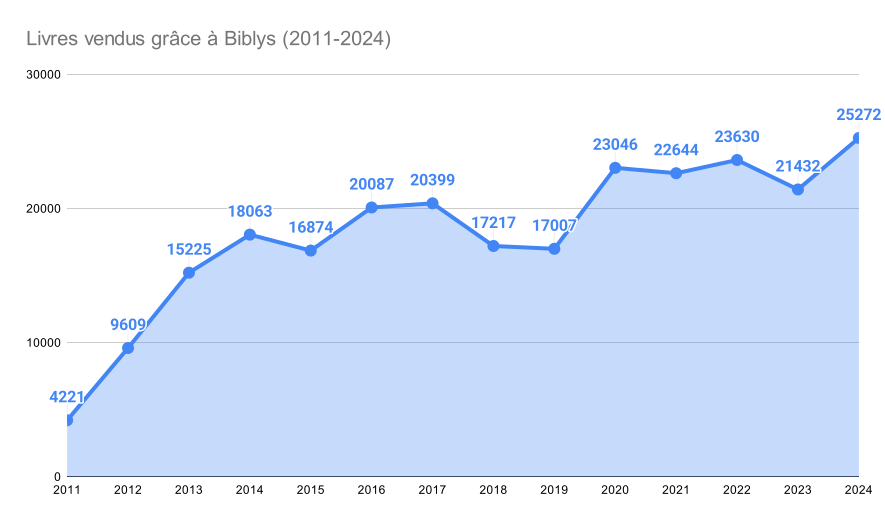
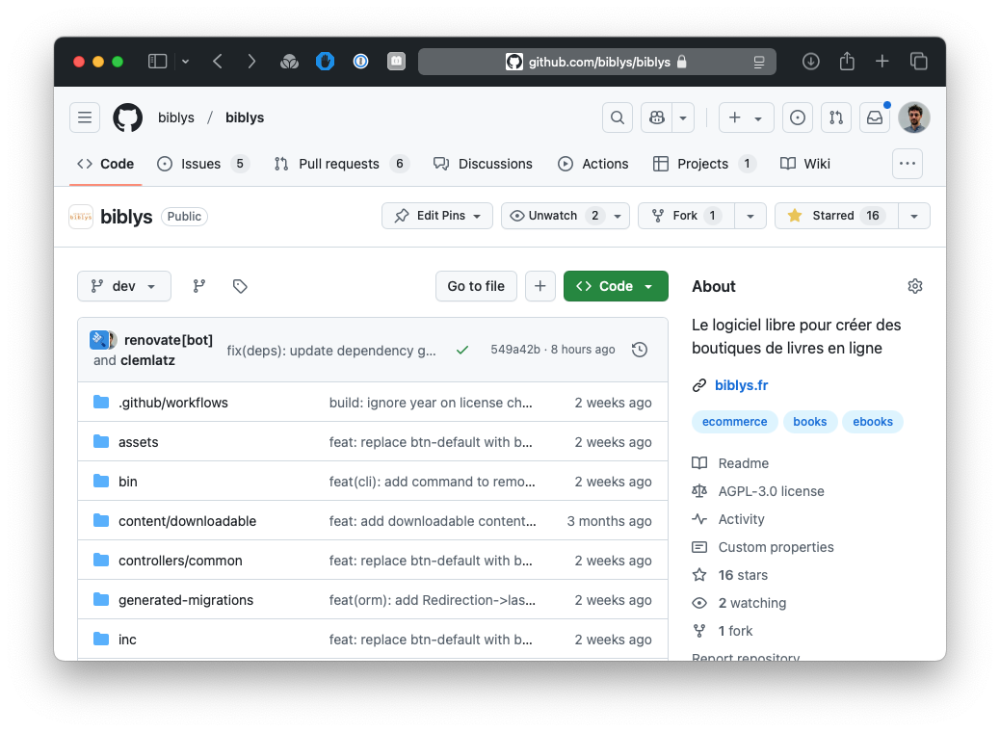
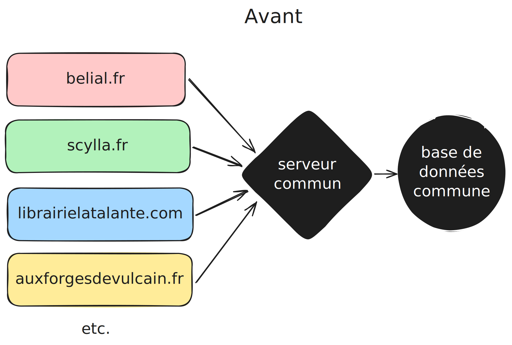
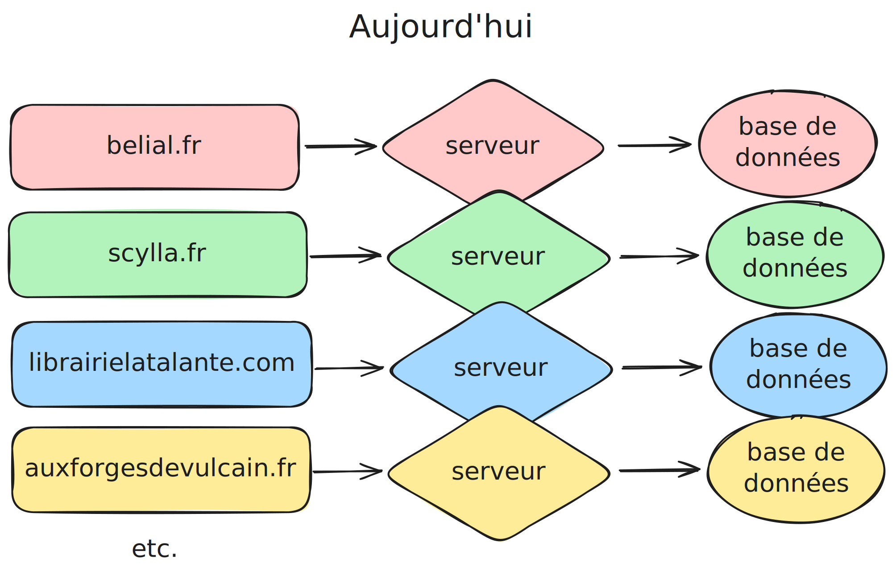
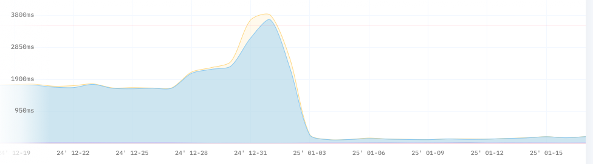
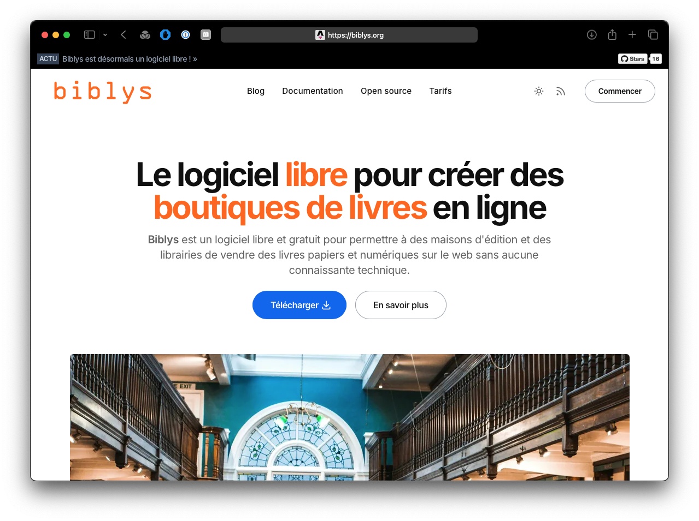

En 2024, Biblys est devenu un logiciel libre, et a permis à quatorze librairies et maisons d’édition indépendantes de
vendre :

- 25.272 livres
- à 3579 client·es uniques
- pour un chiffre d’affaires total de 339.074 € !

C’est donc une belle progression (18%) par rapport aux
[21.432 livres qui avaient été vendus en 2024](/posts/bilan-2023-et-perspectives-2024/), 
avec un score qui dépasse même celui des années covid. Et si l’augmentation du chiffre d’affaires peut sans doute être
en partie impartie imputée à l’inflation, je suis heureux de voir que Biblys permet à toujours plus de livres
d’atteindre leur lecteur·ices, avec notamment l’ouverture de trois nouveaux sites de maisons d’édition en 2024 !

Au total, ce sont plus de 250.000 livres qui ont été vendus grâce à Biblys depuis sa création en 2008.

## Bilan 2024

### Toujours motivé !

La fin d’année 2024 a été marquée, pour moi, par le passage de Biblys au logiciel libre et le transfert de tous les
sites existants sur des hébergements individuels, dont j’ai proposé à mes client·es d’être les propriétaires.

Certain·es ont pu se demander si cela signifiait que j’allais moins m’investir, voire abandonner Biblys, aussi, je tiens
à rassurer tout le monde. J’ai bien l’intention de continuer à travailler sur le logiciel, et ce nouveau fonctionnement
m’offrant aussi de nouvelles possibilités, je suis plus motivé que jamais.

### La famille Biblys s’agrandit

La promotion Biblys 2024 compte trois nouvelles maisons d’édition, une création et deux qui avaient déjà des sites mais
ont choisi de passer à Biblys :

- [Le Baiser du frelon](https://lebaiserdufrelon.fr)
- [Aux forges de Vulcain](https://auxforgesdevulcain.fr)
- [Flatland Éditeur](https://flatland-editeur.fr)

Dans le cas des Forges de Vulcain, je suis particulièrement heureux d’avoir pu travailler avec le graphiste Quentin
Chapelain pour produire un habillage très graphique aux couleurs de la maison.

Quant au site de l’association Flatland, il a été ouvert dans l’urgence pour remplacer un précédent site défectueux,
d'où son aspect visuel très simple. Le site devrait être habillé définitivement avant le printemps. Mais grâce à
l’habillage de base fourni avec Biblys, il est déjà pleinement fonctionnel !

### Un logiciel libre

Depuis le 30 octobre dernier,
[Biblys est désormais un logiciel libre](https://blog.biblys.org/posts/biblys-est-desormais-un-logiciel-libre/) !
C’est une grande fierté pour moi et l’aboutissement de longs chantiers commencés il y a sept ans.

Je ne reviens par sur cette aventure à laquelle j’ai déjà consacré
[un long billet](https://blog.biblys.org/posts/biblys-est-desormais-un-logiciel-libre/),
mais je redis tout de même ce que cela signifie : désormais, tout le monde peut télécharger, installer, modifier et
utiliser Biblys librement et gratuitement, même sans passer par moi !

Le code de Biblys, distribué sous license AGLP-v3, est [disponible sur GitHub](https://github.com/biblys/biblys).

### SaaSuffit comme ça

Fin 2024, je suis passé, pour les sites que je gére, d’un modèle très centralisé (dit « SaaS ») où tous les sites
étaient hébergés sur un unique serveur géré par moi et partageaient leur base de données, à modèle où chaque site
dispose de son hébergement et sa base de données isolés.

Outre les gains en termes de performances, de sécurité et de protection des données personnelles, cela permet à mes
client·es de récupérer la propriété de leur hébergement. L’intérêt est double : en payant directement l’hébergement, mes
client·es paient moins cher que si je dois le prendre en leur nom et le refacturer, et s’il devait m’arriver quelque
chose, leur site ne disparaîtrait pas avec moi.

Le seul est inconvénient est qu’avec l’ancien fonctionnement, les librairies pouvaient profiter des données
bibliographiques fournies par les éditeurs pour leur site. Ce n’est plus le cas, mais le sujet du partage libre des
donnés bibliographique est un sujet sur lequel j’aimerais travailler à l’avenir ! J'en parle un peu plus bas.

### La fin de gros chantiers techniques

Cette année, j’ai mis beaucoup d’effort sur la gestion des utilisateur·ices, pour permettre à Biblys de gérer les
inscriptions indépendamment du fournisseur d’identité Axys : c’était une pré-requis essentiel pour que Biblys puisse
fonctionner indépendamment du serveur principal. Désormais, il est possible de créer un compte directement sur un site
Biblys sans passer par Axys, et donc pour un site Biblys de fonctionner sans Axys.

Dans le même ordre d’idée, la gestion des images (de couverture, d’illustration des billets de blogs, les photos
d’auteur·ices, etc.) qui était auparavant mutualisée, a été rapatriée de manière à être la responsabilité de chaque
site.

### Des nouvelles fonctionnalités

Ces deux chantiers techniques étaient nécessaires pour que Biblys puisse devenir un logiciel libre et être installé sur
n’importe quel hébergement, mais ils n’ont pas été les seules évolutions fonctionnelles en 2024. On retiendra
notamment :

- [La suggestion de livres depuis le panier](https://blog.biblys.org/posts/suggerez-des-livres-a-ajouter-au-panier/)
- Les opérations promotionnelles (du type “un objet offert pour deux livres achetés”)
- [L’expédition avec Mondial Relay](https://docs.biblys.org/configurer/mondial-relay/)

Le détail de chaque mise à jour [est disponible sur Github](https://github.com/biblys/biblys/releases) pour celles
sorties depuis le 30 octobre. On peut également retrouver les plus anciennes
[dans le changelog](https://github.com/biblys/biblys/blob/dev/CHANGELOG.md).

## Perspectives 2025

À présent que les gros chantiers techniques nécessaires à la libération du code de Biblys sont terminés, je vais pouvoir
m’attaquer plus facilement à des fonctionnalités que j’aimerais ajouter à Biblys depuis longtemps.

Mon objectif est d’ajouter à Biblys au moins la première et d’entamer l’une des deux autres, mais si l’une de ces
fonctionnalités vous intéressent particulièrement, faites-le moi savoir !

### Les widgets

Aujourd’hui, la gestion du contenu éditorial dans Biblys est compliquée et il y a pour mes client·es un réel besoin
d’avoir des pages d’accueil plus attrayantes et plus informatives.

Au-delà de l’éditeur de texte enrichi des pages statiques qui permet d’insérer des images, toute mise en page un peu
avancée demande d’éditer directement le HTML des pages, ce qui n’est pas à portée de tout le monde.

Mon idée est de proposer dans le courant de l’année des widgets qui permettront à chacun de gérer ce contenu facilement,
directement avec l’interface d’administration de Biblys, sans avoir à écrire de HTML. Parmi les besoins identifiés : un
carousel de bannière défilante, une liste des billets de blogs, un livre unique, un rayonnage de livres (issu des
nouveauté, d’un rayon, d’une collection), etc.

Un pré-requis pour permettre d’afficher ces pages avec de nombreux éléments, potentiellement lourds, est d’avoir un
système de cache. J’ai commencer à y travailler et à l’expérimenter sur la page d’accueil de la Librairie Scylla, qui
est passée d’un temps de chargement moyen de 1,5 seconde à seulement… 150 millisecondes !

### L’échange de données bibliographiques

Lorsque les sites Biblys partageaient tous la même base de données, les libraires pouvaient profiter des données
bibliographiques, a priori riches et de qualité, crées par les maisons d’édition gérant leur catalogue avec Biblys. Ce
n’est plus cas aujourd’hui.

[J’en parle depuis longtemps](https://blog.biblys.org/posts/bilan-2015-et-perspectives-2016/#:~:text=Biblys%20open%20data)
et [j’ai même déjà expérimenté](https://github.com/biblys/biblys-data-server) sur le sujet : j’aimerais permettre à tous
les sites, qu’ils soient propulsés par Biblys ou non, d’échanger facilement des données bibliographiques, et permettre
aux petites structures d’être moins dépendantes de grosses bases de données commerciales.

Cela pose beaucoup de question, notamment concernant le format des données, mais j’y réfléchis en tâche de fond, et j’ai
commencé à me replonger dans la documentation [ONIX](https://www.editeur.org/11/books/).

### La gestion des manuscrits

Pour une maison d’édition, gérer les manuscrits envoyés par les aspirant·es auteur·ices est une activité chronophage. Si
les manuscrits numériques envoyés par courriel permettent d’économiser de la place, leur gestion restent fastidieuse.

Je pense depuis longtemps que BIblys pourrait aider sur ce sujet, en proposant par exemple une interface sécurisée dans
lequel les auteur·ices téléverseraient le fichier de leur manuscrit, puis pourraient bénéficier d’un suivi pour savoir
le manuscrit est en attente, en cours de lecture, quelle est sa place dans la liste d'attente, etc.

On pourrait imaginer aussi un questionnaire auquel il faudrait répondre avant l’envoi, pour permettre à la maison de
s’assurer que les manuscrits réceptionnés correspondent bien à la ligne éditoriale attendue… et bien d’autres
choses !

### Un nouveau site vitrine

Il y a longtemps que je veux revoir le site de présentation un peu vieillot de Biblys. La disponibilité de Biblys en
open source qui, j’espère, aidera à faire connaitre le logiciel, est l’occasion idéale !

J’ai commencé à travailler sur ce nouveau site et j’espère pouvoir vous le présenter prochainement. En attendant, voici
un aperçu.

## En conclusion

Il ne me reste qu'à vous souhaiter à toutes et tous une excellente année 2025 !

Clément

---
Illustration de couverture :
Photo de
<a href="https://unsplash.com/fr/@itfeelslikefilm?utm_content=creditCopyText&utm_medium=referral&utm_source=unsplash">
🇸🇮 Janko Ferlič
</a>
sur
<a href="https://unsplash.com/fr/photos/photo-de-bibliotheque-avec-lumieres-allumees-sfL_QOnmy00?utm_content=creditCopyText&utm_medium=referral&utm_source=unsplash">
Unsplash
</a>
      
