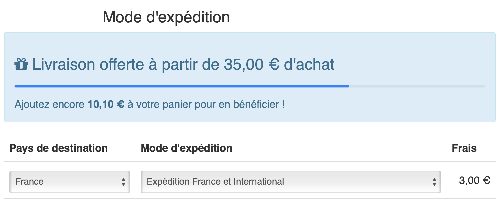
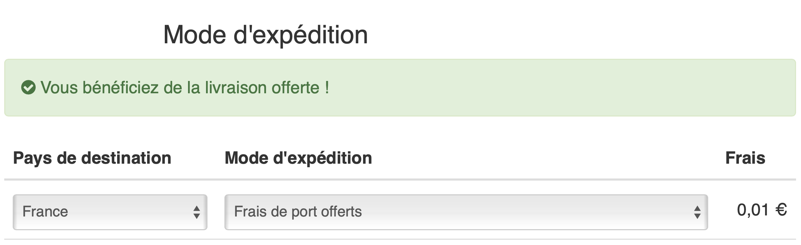
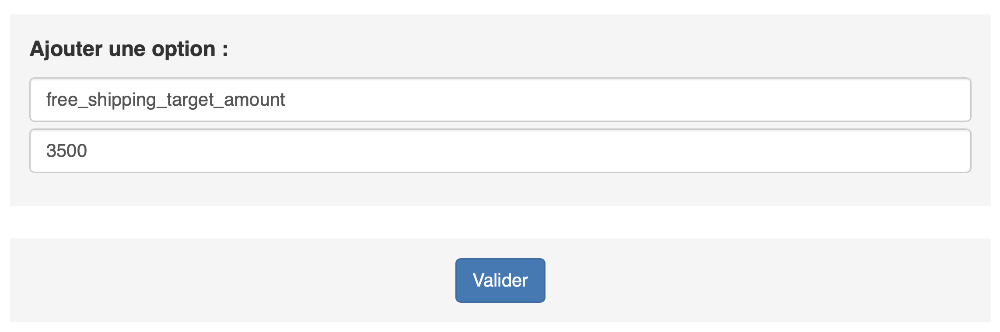
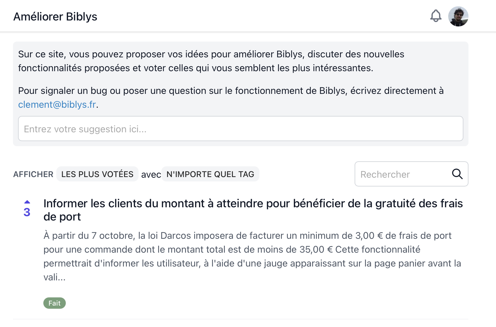

**Depuis le 7 octobre, la loi Darcos oblige à facturer un minimum de 3,00 € de frais de port par commande, avec la
possibilité de proposer la gratuité à partir de 35,00 € d'achat. Comment faire connaître ce bénéfice à vos clients et
les encourager à atteindre ce montant pour bénéficier de la gratuité ?**

C'est possible grâce à une nouvelle option du panier Biblys. Lorsqu'elle est activée, le panier affiche une barre de
progression indiquant le montant d'achat à ajouter au panier pour bénéficier de la gratuité.

Lorsque le montant cible est atteint, la barre de progression laisse place à un message de succès informant le client
qu'il bénéficie des frais de ports offerts.

## ⚙️ Comment configurer la barre de progression ?

Cette option s'active depuis l'outil **Options du site** de l'administration. La clé à ajouter est `free_shipping_target_amount`,
le montant étant la valeur cible, en centimes, à atteindre pour bénéficier des frais de port offert. On peut entrer le
minimum autorisé par la loi, `3500`, ou un montant supérieur.

**Attention :** cette option détermine uniquement l'affichage de la barre de progression, mais elle est décorrélée du
calcul des frais de port qui seront effectivement facturés au client. Il faut donc vous assurer, grâce à l'outil **Frais
de port**, que les tranches tarifaires correspondant gratuites correspondent à ce montant.

Pour savoir comment configurer les frais de port de votre site en accord avec la loi Darcos, vous pouvez consulter
l'article [Entrée en vigueur de la loi Darcos](https://blog.biblys.fr/posts/entree-en-vigueur-de-la-loi-darcos).

## ✍️ Comment personnaliser les textes affichés ?

Deux options supplémentaires permettent de personnaliser les textes affichés aux clients :

- `free_shipping_invite_text` permet de configurer le texte invitant le client à ajouter des articles à son panier
  lorsque le montant total de celui-ci est inférieur au montant cible (par défaut "Livraison offerte à partir de 35,00 € d'achat")
- `free_shipping_success_text` permet de configurer le texte affiché au client lorsque le montant du panier atteint
  ou dépasse le montant cible (par défaut "Vous bénéfiez de la livraison offerte !").

## 💡Améliorer Biblys

Cette fonctionnalité a été développée en priorité parce qu'elle était la plus populaire sur le site
[Améliorer Biblys](https://ameliorer.biblys.cloud). N'hésitez pas à utiliser cette plateforme pour me faire part de vos
besoins d'améliorations et voter pour les propositions qui vous paraissent les plus pertinentes !

## 🙇 Merci de votre attention !

N’hésitez pas à [me contacter](https://www.biblys.fr/contact/) pour me faire part de vos questions et remarques.
Envie d'en discuter ? [Prenez rendez-vous](https://cal.com/clemlatz/rdv) pour un appel en visio !

---
