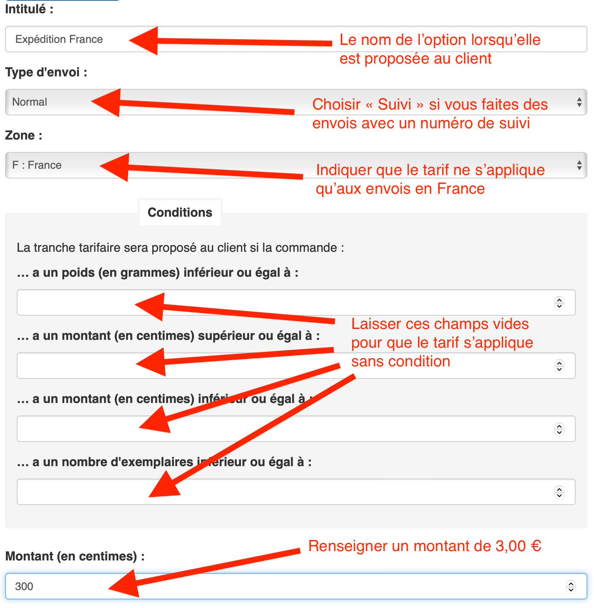
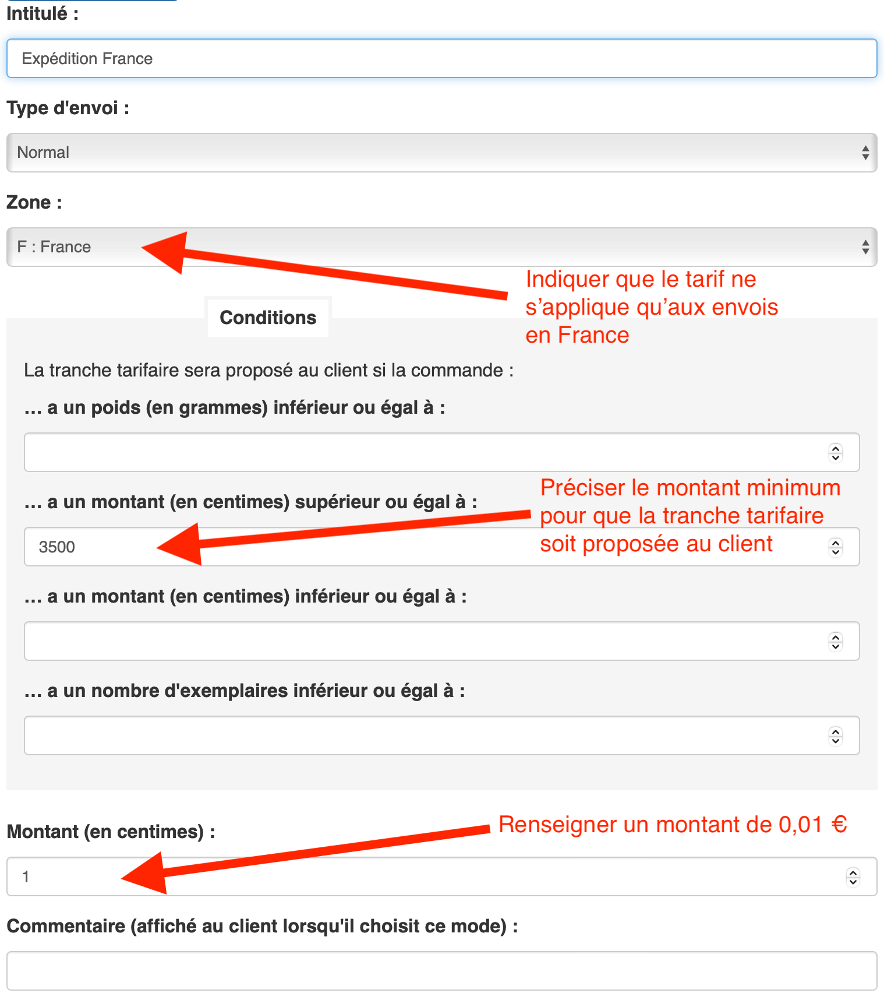

---

title: Entrée en vigueur de la loi Darcos sur les frais de port
excerpt: La loi Darcos, rendant obligatoire un tarif minimal de 3,00 € de frais de port pour le livre, entrera en vigueur le 7 octobre 2023.
image: ~/assets/images/blog/entree-en-vigueur-de-la-loi-darcos/cover.jpg
published: true
publishDate: 2023-08-30T10:00:00.000Z
author: Clément Latzarus
---

**La loi Darcos, rendant obligatoire un tarif minimal de 3,00 € de frais de port pour le livre, entrera en vigueur le 7 octobre 2023.**

## 🤔 Que se passe-t-il ?

Voici le [communiqué du Syndicat de la Librairie Française](https://www.syndicat-librairie.fr/actualites/frais-de-port-un-premier-pas-pour-une-concurrence-plus-equilibree-sur-internet) :

**&laquo; Le gouvernement a publié le 7 avril l’arrêté permettant l’entrée en vigueur du tarif minimal de frais de port dont le
principe a été fixé par la loi du 30 décembre 2021.** Cette loi, dite "loi Darcos", vise à conforter l’économie du
livre et à renforcer l’équité et la confiance entre ses acteurs.

Cette loi avait pour objectifs de rééquilibrer les conditions de concurrence sur le marché de la livraison de livres et,
ainsi, de permettre aux libraires de pouvoir développer leur présence sur internet. Sur proposition de l’ARCEP, le
gouvernement a retenu **un seuil plancher de frais de port de 3 euros pour les commandes jusqu’à 35€ et de 1 centime
d’euro au-delà**. Le cabinet de la ministre de la Culture a confirmé au SLF que ce seuil s’appliquerait également aux
commandes mixtes composées de livres et d’autres produits, ainsi qu’à celles passées dans le cadre des programmes de
fidélité proposées par les plateformes sur internet. Comme le prévoit la loi, la mesure s’appliquera six mois après la
publication de l’arrêté, soit à partir du 7 octobre 2023. (...) &raquo;

## ⚙️ Comment configurer les frais de port à 3,00 € ?

**Si votre site est actuellement configuré avec des frais de port inférieurs à 3,00 €, il vous faudra modifier cette configuration pour rester dans le cadre de la loi.**

Depuis l'outil Frais de port de l'administration de votre site, vous pouvez ajouter de nouvelles tranches tarifaires ou modifier les tranches existantes.

Vous trouverez ci-dessous un exemple de configuration pour facturer 3,00 € de frais de port pour les commandes à destination de la France, quelque soient les autres conditions
(poids, montant, nombre d'articles…).

## ⚙️ Comment configurer la "gratuité" au-delà de 35,00 € ?

**La loi autorise à continuer à facturer un minimum de 0,01 € de frais de port si le montant total de la commande est de 35,00 € ou plus.**

Voici un exemple de configuration pour facturer un centime d'euro 0,01 € de frais de port pour les commandes à destination de la France dont le montant est supérieur ou égal à 35,00 €.

NB : si plusieurs tranches tarifaires remplissent les conditions, seule la moins chère sera proposée au client. Il n'est donc pas nécessaire définir un montant maximum de 34,99 € pour la première tranche

## 💡 Comment inciter mes clients à bénéficier de la "gratuité" des frais de port ?

**Une amélioration envisagée pour Biblys permettrait d'indiquer clairement sur la page panier, avant la validation de commande, le montant de commande minimum à atteindre pour bénéficier des frais de port offerts.**

Si cette idée vous paraît pertinente, je vous encourage à voter pour elle sur la plateforme Améliorer Biblys, qui me permet de prioriser les développements prévus en fonction de vos besoins.

## 🙇 Merci de votre attention !

N’hésitez pas à [me contacter](/contact/) pour me faire part de vos questions et remarques.

Envie d'en discuter ? [Prenez rendez-vous](https://cal.com/clemlatz/rdv) pour un appel en visio !

Excellente journée à tous et toutes,

Clément

---

Image de couverture :
[Photo de Oleksandr Gamaniuk sur Unsplash](https://unsplash.com/fr/photos/nv8SBmWFeJE)
