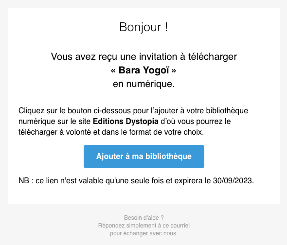
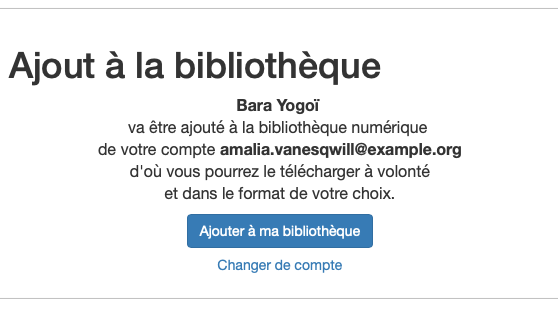
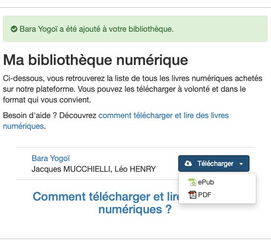
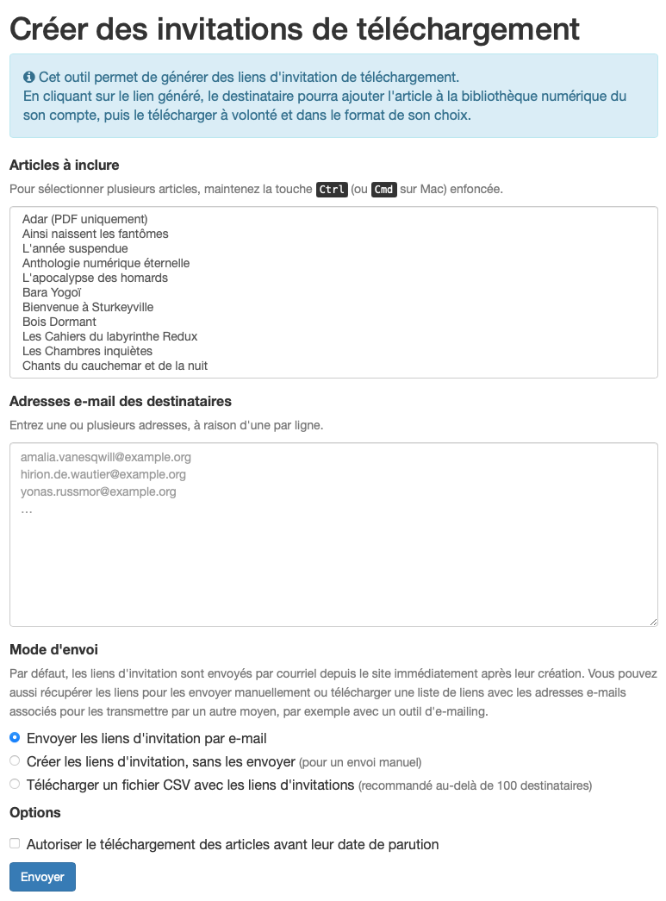
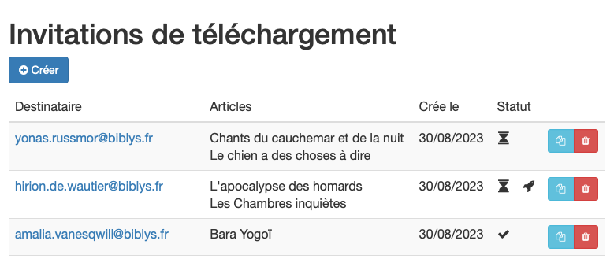
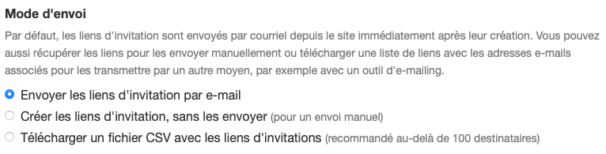

Il est depuis longtemps possible d’envoyer des livres numériques avec Biblys. C’est une fonctionnalité plébiscitée par les éditeurs, qui s’en servent pour envoyer des épreuves, des services de presse, des lots de concours ou pour gérer des abonnements numériques comme le font les éditions du Bélial’ avec la revue Bifrost.

En fait d’envoi, il s’agit en réalité d’ajout à la bibliothèque numérique du lecteur qui, averti par courriel, peut y accéder de manière sécurisée sur le site de l’éditeur. Il peut ensuite télécharger le livre dans le format de son choix et à volonté, y compris lors d’éventuelles mises à jour des fichiers.

Cette fonctionnalité n’était toutefois pas exempte de défauts, que vient corriger **la version 2.72 qui sera déployée début septembre sur les sites Biblys**.

## 💌 Invitations de téléchargement

Dans l’ancien système, les livres étaient ajoutés directement dans la bibliothèque de l’utilisateur, identifiée par son adresse e-mail. Et s’il n’avait pas déjà un compte ? Le système lui en créait un automatiquement et lui adressait un mot de passe aléatoire par courriel. C’était problématique, car si l’utilisateur possédait déjà un compte avec une autre adresse, une seconde bibliothèque distincte était créée et l’administrateur du site devait faire des manipulations supplémentaire pour renvoyer les livres à la bonne adresse. De plus, de nombreux comptes étaient créés inutilement.

Désormais, le livre n’est plus ajouté directement à la bibliothèque. Le destinataire reçoit un lien unique qui lui permettra de le faire.

En cliquant sur le lien, il est redirigé vers le site où il peut s’identifier avec le compte de son choix, pas nécessairement celui correspondant à l’adresse e-mail de réception. Afin de prévenir toute erreur, le titre du livre et le compte utilisateur sont clairement indiqués sur la page de confirmation.

Une fois l’association confirmée et la validité de l’invitation vérifiée, l’utilisateur est redirigé vers sa bibliothèque d’où il peut télécharger le livre. Ici, rien ne change.

## ⚙️ Interface administrateur

L’interface d’envoi est très similaire à l’ancienne : on sélectionne un plusieurs articles, on entre une ou plusieurs adresses e-mail, et on autorise éventuellement le téléchargement avant parution (pratique pour les services de presse).

Une nouveauté est qu’il est désormais possible de visualiser l’ensemble des invitations envoyée et leur état (en attente, utilisée ou expirée).

Depuis cette page, on peut copier le lien d’une invitation en attente pour le renvoyer manuellement si besoin. Il est aussi possible de ne pas envoyer de courriel au moment de la création de l’invitation, pour transmettre ensuite le lien dans un courriel personnalisé ou par un autre moyen.

On peut également supprimer une invitation en attente : le lien associé ne permettra alors plus d’ajouter à la bibliothèque.

## 🚚 Envois en masse

Il était déjà possible d’envoyer un livre numérique à plusieurs utilisateurs en un seul clic. Mais le système atteignait ses limites au-delà d’une centaine d’envois de courriel, ce qui pouvait occasionner des ralentissements, voire des crashs.

Une nouvelle option permet désormais, plutôt que d’envoyer immédiatement les courriels, de télécharger un fichier CSV contenant une liste des liens de téléchargement avec pour chacun l’adresse e-mail associée. Lequel peut ensuite être importé dans un outil d’emailing tel que Mailjet pour créer une campagne d’envoi.

## ⏰ Délai d’expiration des invitations

À partir du moment de sa création, un lien d’invitation est valable un mois. Ce délai écoulé, l’invitation expirera et le lien sera inactif. J’ai choisi le délai qui me paraissait le plus judicieux, mais j’ai aussi imaginé un menu déroulant permettant de choisir un jour, une semaine, un an… dites-moi si une telle fonctionnalité vous semble intéressante.

L’interface d’administration permet de voir toutes les invitations et leur statut : en attente, utilisée ou expirée. Les invitations obsolètes (utilisée ou expirée) peuvent être conservée pour mémoire ou supprimée. Une autre fonctionnalité que j’ai envisagée est un bouton “Supprimer les invitations obsolètes” pour les supprimer toutes d’un clic.

## 🙇 Merci de votre attention !

N’hésitez pas à [me contacter](https://www.biblys.fr/contact/) pour me faire part de vos questions et remarques.

Envie d'en discuter ? [Prenez rendez-vous](https://cal.com/clemlatz/rdv) pour un appel en visio !

Excellente journée à tous et toutes,

Clément

Image de couverture :
[Photo de Andrew Dunstan sur Unsplash](https://unsplash.com/fr/photos/qdUDnCjo7e0?utm_source=unsplash&utm_medium=referral&utm_content=creditCopyText)
