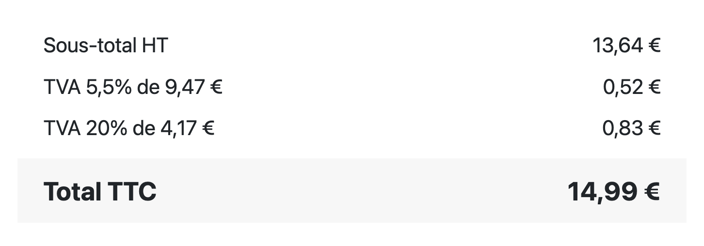
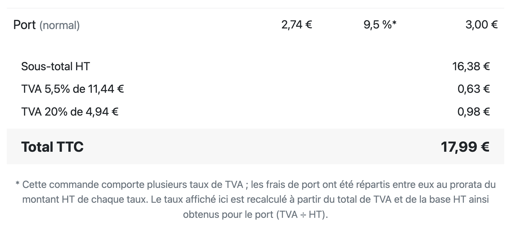
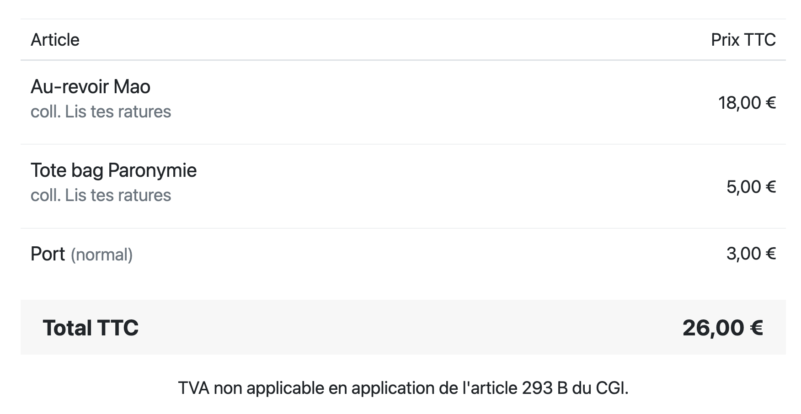
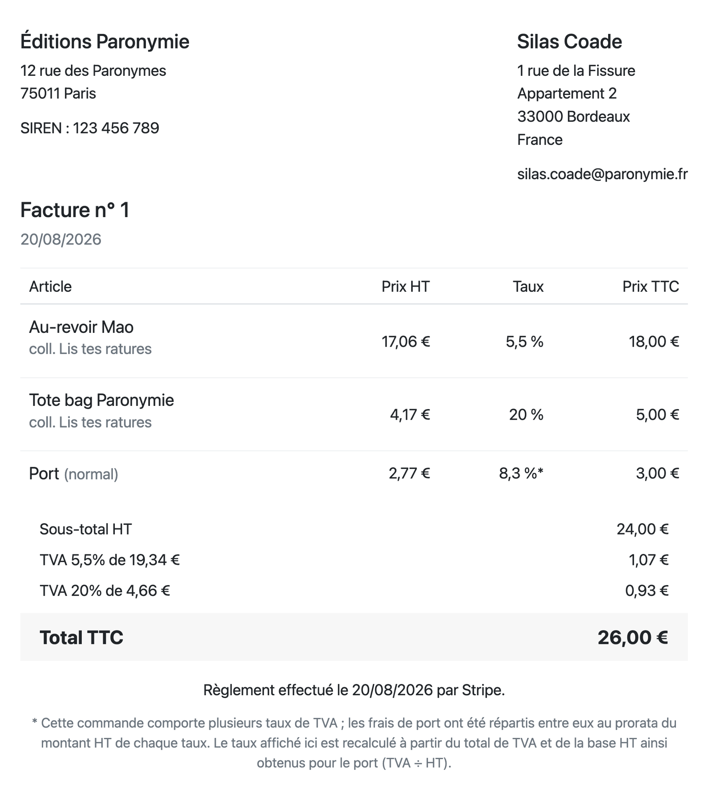

Une facture de vente de livres a l'air simple. Un produit, souvent un seul taux de TVA à 5,5 %, un client. Mais bien souvent,
les logiciels de facturation génériques ignorent les spécificités du livre.

Deux écueils reviennent souvent chez les libraires et éditeur·rices indépendant·es : des factures **incomplètes**,
qui exposent à une amende de 15 € par mention manquante (plafonnée à 25 % du montant facturé), ou des factures
**surchargées**, avec des tableaux de TVA à rallonge même quand un seul taux s'applique (ce qui rend la facture
inutilement difficile à lire).

Qu'est-ce qui est _vraiment_ obligatoire sur une facture, et qu'est-ce qui relève du simple choix
de présentation ? Faisons le point.

## Les mentions obligatoires

La loi ([article 289 du Code général des impôts](https://www.legifrance.gouv.fr/codes/article_lc/LEGIARTI000048827413)
et [article 242](https://www.legifrance.gouv.fr/codes/article_lc/LEGIARTI000046086694/)) impose une liste précise de
mentions :

- L'identité complète du vendeur et du client (nom, adresse)
- Le **numéro SIREN** (obligatoire sur toutes depuis 2026)
- Un numéro de facture unique, dans une séquence chronologique continue, sans trou
- La date d'émission et la date de la vente
- Pour chaque article : sa désignation précise, son prix unitaire hors taxes et le taux de TVA applicable
- Le total hors taxes et le total toutes taxes comprises

Jusqu'ici, rien de bien compliqué. Là où les choses se corsent, c'est sur la manière dont ces
informations doivent être _présentées_ selon la composition de la commande.

## Le cas spécifique du livre : un ou plusieurs taux ?

Dans une librairie généraliste, la grande majorité des commandes ne comportent qu'un seul taux de TVA : 5,5 % pour le
livre. Mais dès qu'un produit dérivé s'invite dans le panier — un mug, un tote bag, une figurine à 20 % — la commande
devient **multi-taux**, et les règles de présentation diffèrent.

À taux unique, un tableau récapitulatif détaillé par taux (base HT, TVA, total, par ligne de taux) n'apporte aucune
information supplémentaire par rapport à une mention simple et directe. À taux multiples, en revanche, la loi impose
que <em>le total hors taxe et la taxe correspondante soient mentionnés distinctement pour chaque taux</em>. Dans ce cas,
un récapitulatif comme celui-ci s'impose :

Beaucoup de logiciels appliquent un seul gabarit, quelle que soit la commande : trop léger dans un cas, trop lourd dans
l'autre. L'idéal est d'adapter l'affichage à la réalité de chaque commande, sans pour autant sacrifier une mention
obligatoire.

## Le piège des frais de port

Un cas concret que beaucoup de professionnels gèrent mal : que faire des frais de port quand la commande mélange
plusieurs taux de TVA ? Le réflexe le plus courant (appliquer un taux unique de 20 % au port, généralement celui du
livre) n'est pas correct dès lors que le panier est mixte.

La règle : les frais de port doivent être **ventilés au prorata du montant HT de chaque groupe de taux**. Si une
commande contient 75 % de livres à 5,5 % et 25 % de goodies à 20 % (en valeur HT), les frais de port se répartissent
dans les mêmes proportions, chaque part héritant du taux de son groupe. C'est un détail technique, mais c'est
précisément le genre de subtilité qui, mal traitée, risque de fausser silencieusement une déclaration de TVA.

## Et si je ne suis pas assujetti·e à la TVA ?

Une bonne partie des petites structures indépendantes du livre (auto-entrepreneur·es, structures associatives) relèvent
de la **franchise en base de TVA** (article 293 B du CGI).
Dans ce cas, elles ne collectent pas de TVA.

Concrètement, ça veut dire :

- **Pas de colonnes TVA du tout** sur la facture, ni taux, ni montant HT. La franchise ne se traduit pas par un taux
  affiché à 0 %, mais par leur absence pure et simple.
- Le prix HT et le prix TTC sont identiques, puisqu'il n'y a pas de taxe à ajouter.
- Une mention obligatoire doit impérativement figurer sur la facture : _« TVA non applicable, article 293 B du CGI »_.

NB : la formulation de cette mention obligatoire va changer au 1er janvier 2027 (voir plus bas).

## Ce qui change en 2026-2027

Plusieurs évolutions de la facturation concernent (ou vont concerner) la vente de livre cette année et l'année
prochaine.

- **SIREN obligatoire** sur toutes les factures depuis 2026, y compris pour les plus petites structures.
- **Transition de la mention franchise** : la référence légale de la mention franchise
  de [l'article 293 B du CGI](https://www.legifrance.gouv.fr/codes/id/LEGISCTA000006162567/) est remplacé par celle du
  nouvel [article L. 223-3](https://www.legifrance.gouv.fr/codes/article_lc/LEGIARTI000006222863) du Code des
  impositions sur les biens et services (CIBS). Cette bascule, initialement prévue au 1er septembre 2026, entrera
  finalement en vigueur au **1er janvier 2027**. En pratique : la mention _« TVA non applicable, art. 293 B du CGI »_
  reste la référence à utiliser jusqu'à cette date. Une fois la
  bascule effective, l'ancienne référence restera encore tolérée jusqu'au 30 juin 2028.
- La **facturation électronique** qui entre en vigueur au 1er septembre 2026 concerne uniquement les ventes entre
  professionnels, et donc pas celles effectuées via Biblys.

## Ce qu'il faut retenir

- Chaque ligne d'une facture doit indiquer désignation, prix unitaire HT et taux de TVA — le reste (montant de TVA, prix
  TTC par ligne) est une question de lisibilité, pas une obligation légale.
- Le récapitulatif de TVA par taux est obligatoire dès qu'il y a plusieurs taux dans une même commande (et superflu,
  sous sa forme complète, quand il n'y en a qu'un).
- Les frais de port doivent être ventilés par taux dans les commandes mixtes, pas rattachés arbitrairement à un seul
  taux.
- La franchise en base de TVA n'est pas un taux à 0 % : c'est l'absence de colonnes TVA, remplacée par une mention
  légale précise. Sa formulation changera au 1er janvier 2027.
- Les échéances 2026-2027 (SIREN, CIBS, facturation électronique) concernent toutes les structures.

## Biblys s'occupe de tout ça pour vous

Biblys est le logiciel libre pensé spécifiquement pour les librairies et maisons d'édition indépendantes. Le moteur de
facturation intègre nativement toutes les subtilités abordées dans cet article : gabarit adapté automatiquement selon le
nombre de taux présents dans la commande, ventilation correcte des frais de port au prorata, gestion différenciée
franchise / assujetti avec les bonnes mentions légales et suivi des évolutions réglementaires à venir (SIREN,
transition CIBS, facturation électronique) sans que vous ayez à y penser.

Vous n'avez pas à choisir entre une facture conforme et une facture lisible : Biblys s'occupe des deux.

## Nota bene

L'auteur de cet article n'est ni comptable, ni juriste. Les informations qui y sont données découlent de ma
compréhension personnelle et n'ont pas de valeur légale.

---

Illustration de couverture : Photo
de <a href="https://unsplash.com/fr/@fin21?utm_source=unsplash&utm_medium=referral&utm_content=creditCopyText">FIN</a>
sur <a href="https://unsplash.com/fr/photos/une-calculatrice-posee-sur-une-table-en-bois-0rHxkbcvQAE?utm_source=unsplash&utm_medium=referral&utm_content=creditCopyText">
Unsplash</a>
