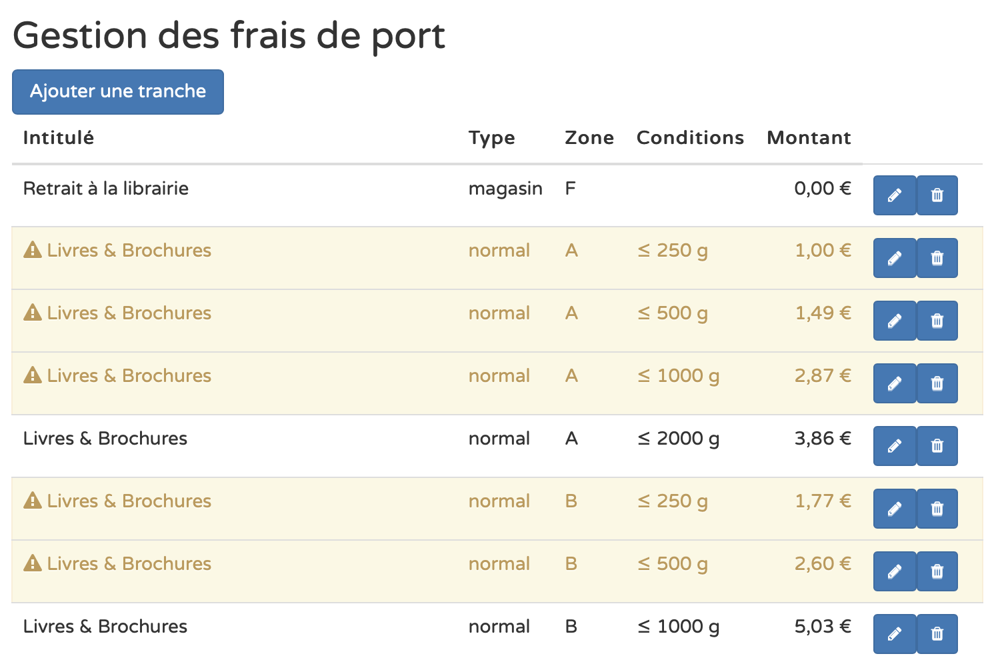

**La [loi Darcos](https://www.syndicat-librairie.fr/actualites/frais-de-port-un-premier-pas-pour-une-concurrence-plus-equilibree-sur-internet),
rendant obligatoire un tarif minimal de 3,00 € de frais de port pour le livre, entrera en vigueur le 7 octobre 2023. C'est demain !**

Êtes-vous prêt ? L'outil de gestion des frais de port de Biblys vous permet de configurer des tranches tarifaires en
accord avec cette nouvelle loi. Pour savoir comment faire, lisez le guide détaillé de l'article
[Entrée en vigueur de la loi Darcos](http://localhost:3000/posts/entree-en-vigueur-de-la-loi-darcos).

La [version 2.73 de Biblys](/posts/biblys-2.73), déployée début octobre, apporte une amélioration de cet outil qui
permet de repérer d'un coup d'œil les tranches tarifaires qui ne sont plus en accord avec la nouvelle loi. Ceux-ci
apparaissent en jaune, précédés du sigle ⚠️.

## 🙇 Merci de votre attention !

N’hésitez pas à [me contacter](/contact/) pour me faire part de vos questions et remarques.
Envie d'en discuter ? [Prenez rendez-vous](https://cal.com/clemlatz/rdv) pour un appel en visio !

---

Image de couverture :
[Photo de Andrew Dunstan sur Unsplash](https://unsplash.com/fr/photos/qdUDnCjo7e0?utm_source=unsplash&utm_medium=referral&utm_content=creditCopyText)
