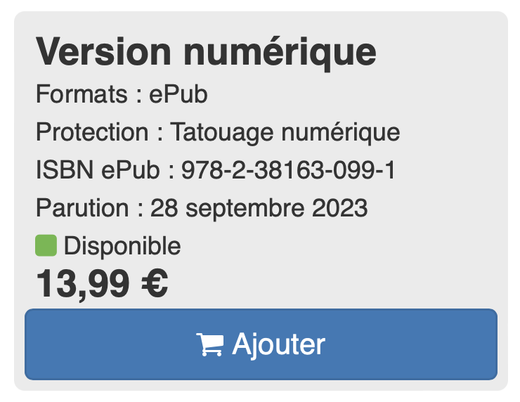
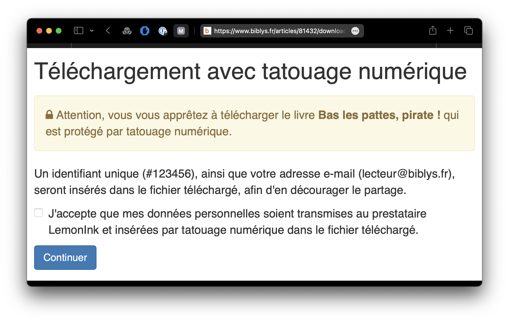
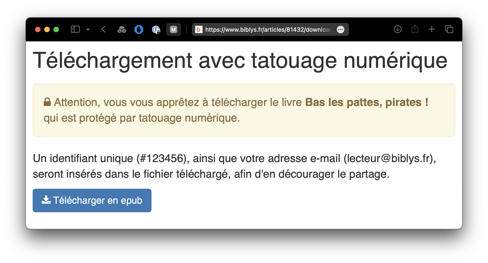

---

title: Protégez vos livres numériques grâce au watermarking
excerpt: Le principe du tatouage numérique est de modifier un fichier en y insérant une chaine de caractère unique, permettant son identification. Contrairement au DRM, l’idée n’est pas d’empêcher techniquement le partage du livre en rendant sa lecture difficile, mais d’en décourager le partage puisque celui ou celle qui s’y risquerait serait démasqué par cet identifiant unique.
image: ~/assets/images/blog/protegez-vos-livres-numeriques-grace-au-watermarking/cover.jpg
author: Clément Latzarus
published: true
publishDate: 2023-12-05T08:00:00.000Z
---

**J’ai souvent eu l’occasion de [dire tout le mal que je pensais des DRMs](https://blog.biblys.fr/posts/pourquoi-il-faut-faire-passer-l-amendement-sur-la-tva-des-livres-numeriques) (mesure de protection technique) sur le livre numérique. Non seulement ils sont peu efficaces, car facilement contournables pour des lecteur·rice·s motivé·e·s, mais parce qu’ils rendent l’achat et la lecture d’un livre complexes, ils poussent les client·e·s légitimes vers le piratage, qui devient une alternative plus accessible, la gratuité n’étant qu’un bénéfice secondaire.**

_Ceci étant dit_, les maisons d’éditions utilisatrices de Biblys sont parfois contractuellement obligées de commercialiser certains de leurs livres numériques avec une protection - c’est souvent le cas lors de négociation avec des agents littéraires étrangers. Si je me refuse toujours absolument à proposer des livres avec DRMs pour les raisons évoquées plus haut, le tatouage numérique (ou “watermarking”) m’a semblé une alternative acceptable, moins intrusive.

Pour proposer cette fonctionnalité dans Biblys en dégradant le moins possible l’expérience utilisateur, j’ai choisi de mettre l’accent sur la transparence, en informant au maximum l’utilisateur et en le rendant acteur de la pose du filigrane.

## ✍️ Principe et coût

Le principe du tatouage numérique est de modifier le fichier livre numérique en y insérant une chaine de caractère unique, permettant son identification. Contrairement au DRM, l’idée n’est pas d’empêcher techniquement le partage du livre en rendant sa lecture difficile, mais d’en décourager le partage puisque celui ou celle qui s’y risquerait serait démasqué par cet identifiant unique.

Les ayant-droits inquiets du piratage peuvent ainsi dormir sur leurs deux oreilles, certains que leurs client·e·s légitimes tentés par le partage de leurs livres pourront être identifié·e·s et poursuivi·e·s.

Pour la réalisation technique du tatouage, je me suis associé au prestataire [Lemonink](https://www.lemonink.co/home), qui se charge de l’hébergement des fichiers “master” et de la génération des fichiers finaux par l’insertion de l’identifiant unique. Cette prestation est facturé 1 € par transaction (avec un tarif dégressif à partir de 500) : si un·e client·e achète un livre numérique puis le télécharger plusieurs fois ou dans plusieurs formats, seul le premier téléchargement occasionnera une facturation.

## 👤Expérience utilisateur

Une première mesure est d’avertir l’utilisateur au plus tôt, dès la fiche article, que le livre qu’il s’apprête à ajouter à son panier est protégé par tatouage numérique. Il peut alors faire le choix d’acheter un livre protégé, ou bien renoncer à son projet d’achat au plus tôt. Outre l’aspect éthique de la transparence, cela permet au support d’éviter d’avoir à gérer l’annulation et le remboursement de la commande en cas de réalisation tardive.

Une fois l’achat réalisé, au moment du premier téléchargement du livre numérique, une page intermédiaire avertit à nouveau l’utilisateur qu’un tatouage numérique va être inséré dans les fichiers qui vont lui être proposés. L’avertissement indique les informations insérées :

- le numéro de la commande qui permettrait d’identifier l’acheteur en cas de partage frauduleux
- l’adresse e-mail du compte utilisateur qui a simple effet dissuasif

Enfin, il est demandé à l’utilisateur de consentir à la transmission de ses données personnelles à un tiers, une obligation légale.

C’est seulement à partir du moment où l’utilisateur coche la case et clique sur le bouton Continuer que le tatouage numérique est effectivement créé, et donc facturé par LemonInk. À ce stade, l’utilisateur peut encore renoncer à sa commande et en demander le remboursement, sans que le vendeur ait été facturé pour un tatouage inutile.

Lors des téléchargements suivants, l’utilisateur verra toujours l’avertissement concernant le tatouage numérique, pourra télécharger les fichiers sans avoir à passer par l’étape de consentement.

## ⚙️ Mise en place

La configuration du tatouage numérique sur votre site Biblys est simple et gratuite, comprise dans votre abonnement mensuel. L’acte d’insertion du tatouage numérique vous sera facturé directement par LemonInk ([voir les tarifs](https://www.lemonink.co/home/pricing)).

Le tatouage numérique peut être appliqué sur tout ou partie de votre catalogue. Vous pouvez donc choisir de diffuser certains titres avec une protection, et d’autre sans.

Si vous êtes intéressé·e par la mise en place du tatouage numérique, vous pouvez commencer par créer un compte [LemonInk](https://www.lemonink.co/session/register) et [me contacter](/contact/).

## 🙇 Merci de votre attention !

N’hésitez pas à [me contacter](/contact/) pour me faire part de vos questions et remarques.
Envie d'en discuter ? [Prenez rendez-vous](https://rdv.clemlatz.dev/) pour un appel en visio !

---

Illustration de couverture :
Photo de [iMattSmart](https://unsplash.com/fr/@imattsmart?utm_content=creditCopyText&utm_medium=referral&utm_source=unsplash) sur [Unsplash](https://unsplash.com/fr/photos/porte-en-bois-marron-avec-cadenas-Vp3oWLsPOss?utm_content=creditCopyText&utm_medium=referral&utm_source=unsplash)</a>
