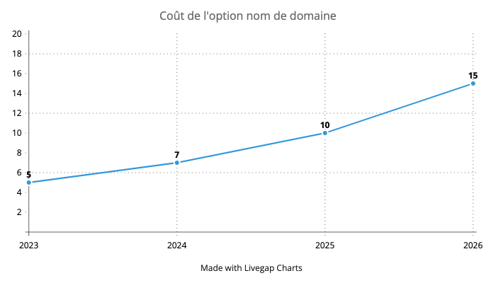

---

title: Tarifs 2024
excerpt: Comme chaque année, avec le mois de septembre est venue l'heure de faire le point sur l'évolution des tarifs Biblys. Les tarifs présentées ci-dessous sont applicables à partir du 1er janvier 2024.
image: ~/assets/images/blog/tarifs-2024/cover.jpg
published: true
publishDate: 2023-09-20T09:00:00.000Z
author: Clément Latzarus
---

**Comme chaque année, avec le mois de septembre est venue l'heure de faire le point sur l'évolution des tarifs Biblys. Les tarifs présentées ci-dessous sont applicables à partir du 1er janvier 2024.**

_Tous les tarifs affichés sur cette page s'entendent Toutes Taxes Comprises, TVA non applicable, article 293 B du Code général des impôts._

## 🏡 Abonnement Biblys de base

**L'abonnement de base passe de 30,00 € à 32,00 € par mois.**

Pour rappel, Biblys est pour moi une activité secondaire dont je ne tire pas de bénéfices. Mon objectif est donc d’équilibrer le prix de l’abonnement et mes dépenses afin que cette activité ne m’en coûte pas non plus. Les revenus générés par l’abonnement me servent à payer l’hébergement, mais aussi les services, outils et formations qui me servent à maintenir et faire évoluer Biblys.

Ces derniers temps, le coût des services d'hébergement a fortement augmenté, pour certains presque doublés. J'ai pu faire quelques économies en changeant certains prestataires (comme Mailjet pour l'envoi des emails transactionnels), mais il reste à un petit déficit à combler qui me conduit à la première augmentation du coût de l'abonnement depuis dix ans.

## 🏷️ Option nom de domaine

**L'option nom de domaine passe de 5,00 € à 7,00 € par mois.**

Comme je l'annonçais l'année dernière, le but de cette option étant d'encourager mes client·e·s à récupérer la propriété de leur nom de domaine, son coût va augmenter progressivement à partir de 2024. Pour savoir pourquoi je recommande fortement cette évolution, vous pouvez lire ou relire l'article Facturation des noms de domaines.

Tous mes clients ne sont pas concernés par cette option : si vous avez un doute, vous pouvez vérifier si l'option figure sur vos factures ou sur la page Abonnement Biblys Cloud de l'administration (ou, bien entendu, me poser la question).

Si c'est votre cas, le coût d'un domaine en .fr chez Gandi étant de 17,99 € par an, en récupérant la propriété de votre nom de domaine, vous pourrez donc économiser 66,00 € par an (voir plus bas comment).

## 📊 Option analytics

**L'option Analytics sera désormais facturée 5,00 € par mois.**

Inclus depuis de nombreuses années dans votre abonnement Biblys, l'outil de statistiques Matomo est l'un des postes les plus importants du budget Biblys (50 € par mois soit environ 20 %). C'est un outil très puissant qui, outre la comptabilité des visiteurs, permet d'associer à un chiffre d'affaires des opérations de communication (mailing, publicité, etc.).

Depuis cette année, je propose également un nouvel outil, Umami, accessible depuis l'administration de votre site. Plus simple, il est aussi bien moins cher, et suffisant pour la plupart de mes clients qui n'ont pas l'usage des fonctionnalités avancées de matomo.

À partir de janvier 2024, seul Umami sera inclus dans l'abonnement, tandis que Matomo sera proposé sous la forme d'une option à 5,00 € par mois. Si vous souhaitez continuer à bénéficier de Matomo, merci de me le faire savoir au plus vite.

## 💳 Moyens de paiement proposés

Ayant changé de banque (là aussi pour faire des économies), **je ne peux plus accepter les paiements par chèque, et ce, depuis le 1er septembre**.

Le paiement reste possible par carte bancaire ou prélèvement bancaire, avec un RIB. J'en profite pour dire que je préfère les règlements par prélèvement bancaire, car les RIB, contrairement aux cartes bancaires, n'expirent pas, ce qui permet d'éviter des incidents de paiement. Néanmoins, les deux moyens de paiements restent disponibles selon votre préférence.

## 💡 Comment économiser en récupérant la propriété de mon nom de domaine ?

**Récupérer la propriété de votre nom de domaine est facile, ne demande pas de compétences techniques et présente de nombreux avantages** que je détaillais dans l'article Facturation des noms de domaine et vous permet d'économiser 66 € par an.

Pour cela, il vous suffit de :

1. créer un compte [Gandi.net](https://account.gandi.net/fr/create_account) (si ce n'est pas déjà fait)
2. me signifier votre souhait de récupérer votre domaine, pour que je déverrouille le transfert et vous fournisse un code d'autorisation
3. [demander le transfert de propriété du domaine](https://shop.gandi.net/fr/b1d7d184-f497-11e7-92ed-00163e6dc886/domain/transfer) ; vous aurez alors à renseigner le code d'autorisation et régler une facture de 14,40 € pour la première année
4. [m'octroyer un accès technique au domaine](https://github.com/biblys/wiki/wiki/Gandi-:-accorder-un-accès-technique-à-un-domaine) pour que je puisse continuer à gérer sa configuration (vous n'aurez rien à faire vous-même)

C'est tout ! Par la suite, vous recevrez chaque année une facture (de 17,99 €) pour le renouvellement du nom de domaine. Vous pouvez enregistrer un moyen de paiement côté Gandi pour que le renouvellement soit automatique.

## 🙇 Merci de votre attention !

N’hésitez pas à [me contacter](/contact/) pour me faire part de vos questions et remarques.

Envie d'en discuter ? [Prenez rendez-vous](https://cal.com/clemlatz/rdv) pour un appel en visio !

Excellente journée à tous et toutes,

Clément

Image de couverture :
[Photo de Aaron Burden sur Unsplash](https://unsplash.com/fr/photos/h7wpIMY3O3E?utm_source=unsplash&utm_medium=referral&utm_content=creditCopyText)
